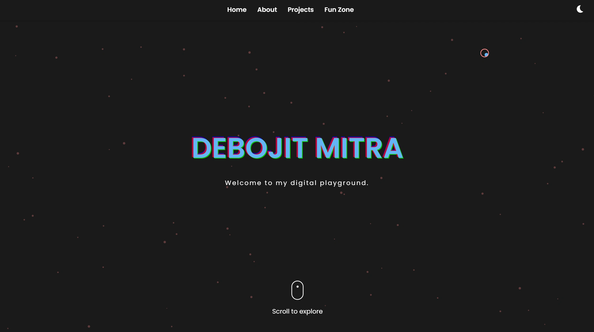

# 🚀 Debojit Mitra's Digital Playground 🎨

Welcome to the behind-the-scenes of my digital wonderland! This repository houses the code for my personal portfolio website, where creativity meets technology in a cosmic dance of pixels and code.

## 🌟 Features

- **🎭 Dynamic Theme Switching**: Toggle between light and dark modes for a personalized viewing experience.
- **🖱️ Interactive Cursor**: A custom cursor that brings a touch of magic to every interaction.
- **🌠 Particle System**: A mesmerizing background that reacts to your movements.
- **⌨️ Typewriter Effect**: Watch my introduction unfold before your eyes.
- **📱 Responsive Design**: Looks great on everything from a smartphone to a cinema display.
- **🎮 Fun Zone**:
  - **Light Mode**: Pop bubbles and chase butterflies in a whimsical game.
  - **Dark Mode**: Create your own constellations in a cosmic canvas.

## 🛠️ Tech Stack

- HTML5
- CSS3 with custom properties for theming
- Vanilla JavaScript (Because sometimes, less is more!)
- GSAP for smooth animations

## 🎨 Customization

Feel free to fork this repo and make it your own! Here are some quick customization tips:

- Change colors in the `:root` section of `style.css`
- Add your own projects in the "My Projects" section of `index.html`
- Modify the particle system behavior in `script.js`

## 🌈 Sections

1. **Home**: A glitchy welcome with a typewriter effect
2. **About**: My skills, expertise, and a friendly introduction
3. **Projects**: A showcase of my digital creations
4. **Fun Zone**: Because all work and no play makes Jack a dull boy!

## 📜 License

This project is open source and available under the [MIT License](LICENSE).

## 🙏 Acknowledgements

- Icons from [Font Awesome](https://fontawesome.com/)
- Fonts from [Google Fonts](https://fonts.google.com/)
- Inspiration from the vast cosmos and the depth of human creativity

---

  Made with ❤️ by Debojit Mitra

